# Guia do Projeto — Mapa de Vitória da Conquista

> O objetivo aqui é mapear **o que é cada parte e como elas conversam** —
> não os detalhes de implementação. Quando o "porquê" de alguma decisão importar,
> este guia aponta para [`DECISOES-TECNICAS.md`](./DECISOES-TECNICAS.md).

---

## 1. O que é o o Projeto

É um **mapa interativo** da cidade de Vitória da Conquista. A tela é um mapa que
ocupa quase tudo, e sobre ele flutuam alguns controles.

O mapa mostra três níveis de divisão do território, do maior para o menor:

| Nível | O que é |
|---|---|
| **Bairro** | A maior divisão. É por onde a navegação começa. |
| **Loteamento** | Um recorte dentro de um bairro. |
| **Setor censitário** | A malha do IBGE, usada como camada de referência. |

Clicando num bairro, ele é enquadrado no mapa, os prédios daquela área sobem em
3D e uma ficha lateral mostra os loteamentos que existem ali dentro. Além disso, o
usuário pode buscar um lugar pelo nome, ligar e desligar cada nível, e trocar entre
três temas visuais (claro, escuro e "antigo", que imita um mapa de pergaminho).

Um detalhe importante de contexto: **o projeto é um MVP**. Ainda não existe banco de
dados — os dados vêm de arquivos, e alguns campos são inventados de propósito para
demonstrar a interface. A seção 5 diz exatamente quais.

---

## 2. Anatomia da tela


### Desktop

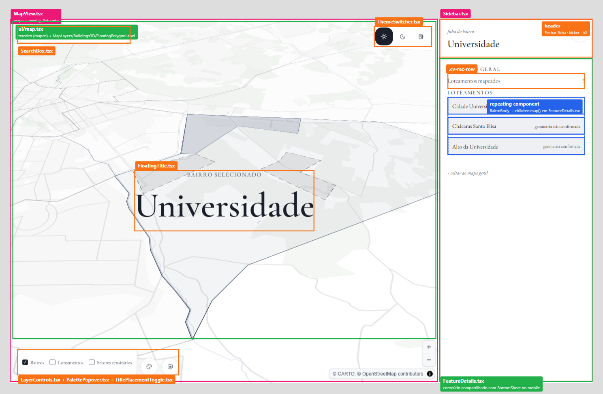

- **Rosa** — `MapView.tsx`, que envolve tudo, e `Sidebar.tsx`, o painel da direita.
- **Verde** — as áreas de conteúdo: o mapa em si (`ui/map.tsx`, com `MapLayers`,
  `Buildings3D` e `FloatingPolygonLabel` desenhando dentro dele) e `FeatureDetails.tsx`,
  o miolo da ficha.
- **Laranja** — os controles flutuantes: busca, troca de tema, título do que está
  selecionado e, no rodapé, os interruptores de camada, paleta e rótulo.
- **Azul** — um trecho que se repete: cada loteamento da lista é o mesmo bloco
  renderizado várias vezes.

### Mobile

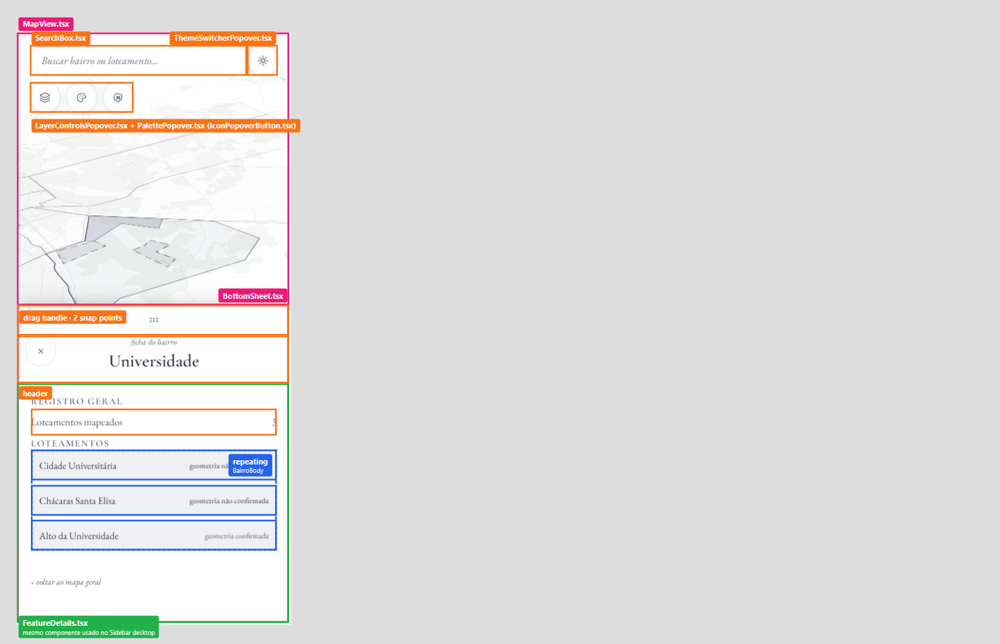

No celular a estrutura é a mesma, com duas diferenças: o painel lateral vira uma
**folha que sobe de baixo** (`BottomSheet.tsx`, arrastável, com duas alturas), e os
controles que no desktop ficam abertos viram **botões redondos que abrem um menu**
(os `*Popover.tsx`). O conteúdo da ficha, em verde na imagem, é literalmente o mesmo
componente nos dois casos.

### A árvore, em forma de diagrama

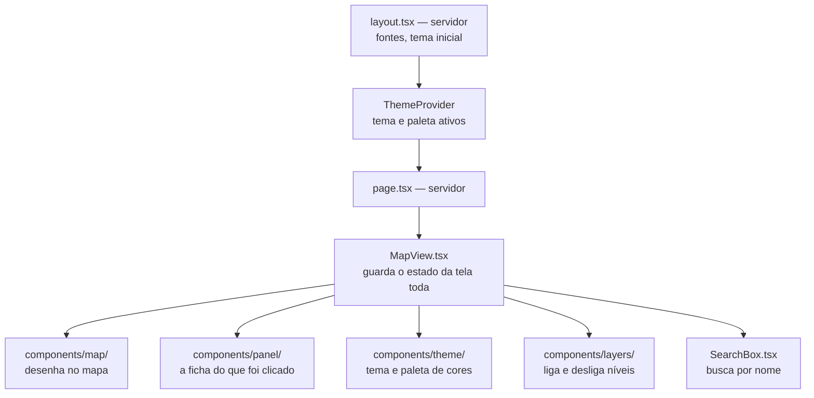

O ponto a guardar: **`MapView` é o centro**. Ele guarda o que está selecionado, o que
está sob o cursor e quais camadas estão ligadas, e distribui isso para todos os
outros. Os demais componentes quase não têm estado próprio — recebem tudo pronto.

### A ficha: FeatureDetails, Sidebar e BottomSheet

`FeatureDetails.tsx` é só o **conteúdo** da ficha — sem moldura de painel.
`Sidebar` (desktop/tablet) e `BottomSheet` (mobile) são duas molduras
diferentes ao redor dele: o `MapView` monta as duas **sempre**, e quem
decide qual aparece é CSS (`hidden md:block` / `md:hidden`), não uma
condição em JavaScript — assim redimensionar a janela pelo breakpoint não
remonta nada nem perde o estado de arraste da folha mobile.

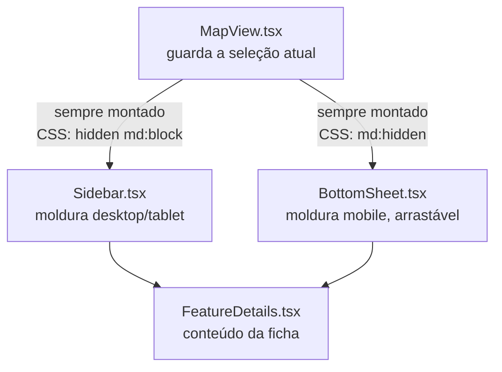

`FeatureDetails` é o mesmo componente nas duas pontas — o diagrama acima
representa as duas instâncias, cada painel monta a sua. A lógica de "voltar"
(‹ voltar ao mapa geral ou ‹ voltar para [bairro-pai]) é centralizada dentro
de `FeatureDetails`, decidindo se deve fechar a ficha ou navegar pro nível anterior.

---

## 3. Estrutura de pastas

```
src/
├── app/                  A página em si (App Router)
│   ├── layout.tsx          Moldura: fontes, tema inicial, ThemeProvider
│   ├── page.tsx            A única rota ("/"), que só renderiza o MapView
│   └── globals.css         Estilos e as cores dos três temas
│
├── components/           Tudo que aparece na tela
│   ├── MapView.tsx         O orquestrador (ver seção 2)
│   ├── SearchBox.tsx       A busca por nome
│   ├── IconPopoverButton.tsx  Botão redondo que abre um menu (usado por vários)
│   ├── map/                O que é desenhado no mapa
│   ├── panel/              A ficha lateral (desktop) e a folha inferior (mobile)
│   ├── theme/              Troca de tema e paleta de cores
│   ├── layers/             Liga/desliga bairros, loteamentos e setores
│   ├── icons/              Ícones
│   └── ui/                 ⚠️ Biblioteca externa de mapas — não editar
│
├── hooks/                Lógica reutilizável (buscar dados, ler o tema, etc.)
├── lib/                  Funções de apoio, sem tela
│   ├── color/              Tema, paletas e conversão de cores
│   └── map/                Contas e utilidades de mapa
├── config/               Valores ajustáveis (quais níveis existem, prédios)
└── types/                Vocabulário de tipos compartilhado

public/data/              Os arquivos GeoJSON servidos para o navegador
scripts/                  Preparação dos dados (roda à mão, fora do site)
docs/                     Esta documentação
```

A divisão em `lib/color/` e `lib/map/` segue a mesma ideia das pastas de
`components/`: agrupar por assunto, para que o nome da pasta já diga do que se trata.

---

## 4. O que carrega primeiro

Uma dúvida comum: se o mapa é feito no navegador, o que o servidor manda?

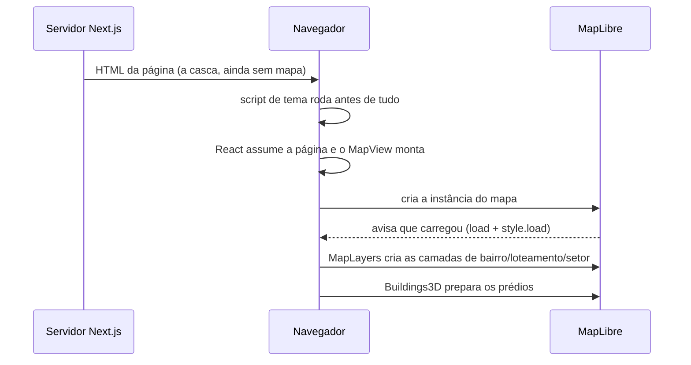

Dois detalhes valem nota:

O **script de tema** é uma injeção de JavaScript que o `layout.tsx` injeta e que roda
*antes* da página aparecer. Ele lê o tema que o usuário escolheu da última vez e já
aplica. Sem isso, quem usa o tema escuro veria um flash branco a cada carregamento (anti-FOUC).

As camadas **só são criadas depois** que o MapLibre avisa que terminou de carregar.
Por isso a ordem acima importa: tentar criar uma camada antes disso simplesmente
falha. O mesmo vale toda vez que o usuário troca de tema, porque trocar o tema
recarrega o mapa de fundo inteiro e apaga as camadas — que são recriadas em seguida.

---

## 5. De onde vêm os dados

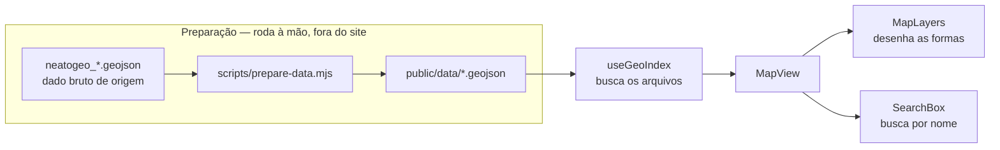

O comando `npm run prepare-data` pega os arquivos brutos, faz duas coisas — descobre
a qual bairro cada loteamento pertence e marca alguns como "geometria não
confirmada" — e grava o resultado em `public/data/`. Isso **não** roda junto com o
site: é um passo manual, feito quando o dado de origem muda.

**Isso é feito para mockar os dados. Quando houver banco de dados, esse passo não será necessário.**

No navegador, o hook `useGeoIndex` busca esses arquivos uma única vez e entrega o
resultado ao `MapView`, que repassa para quem precisa. O mesmo dado serve para
desenhar as formas no mapa e para a busca por nome.

Além desses arquivos locais, duas coisas vêm de fora, prontas:

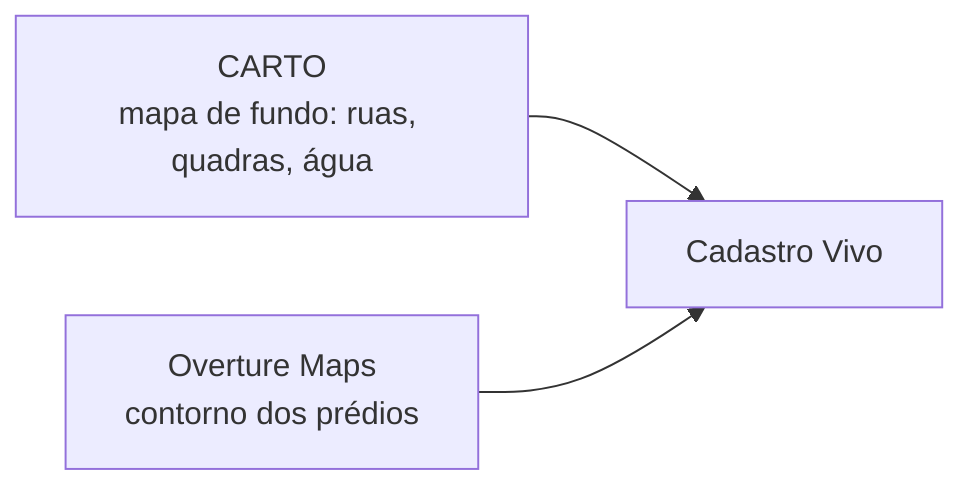

**O que é inventado (e por quê).** Sendo um MVP, a marca
de "geometria não confirmada" nos loteamentos também é mockado. 
Marcados no código com o comentário `MOCK (MVP)`, e saem quando existir
uma fonte real.

---

## 6. O que acontece ao clicar num bairro

Este é o fluxo central da aplicação. Vale ler o diagrama junto com a ideia de que
**`MapView` é o único que guarda o estado** — todo o resto reage a ele.

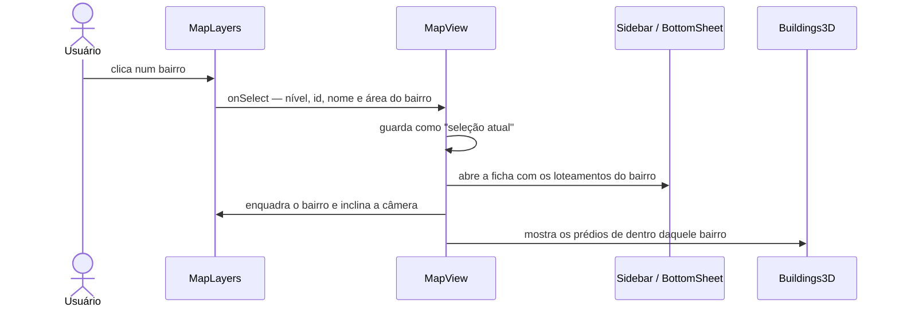

Repare que `MapLayers` **não decide nada**: ele avisa `MapView` do clique e volta a
esperar. Quem decide o que isso significa é o `MapView`, que atualiza seu estado; e
é a mudança desse estado que faz a ficha abrir, o mapa se mover e os prédios subirem.
Esse mesmo padrão se repete no hover e na busca.

Há uma regra de navegação embutida: o primeiro clique sempre seleciona o **bairro**,
mesmo que o cursor esteja sobre um loteamento. Só depois de estar dentro de um bairro
é que clicar num loteamento o seleciona. Isso dá uma hierarquia ("primeiro onde,
depois qual") em vez de saltos confusos.

---

## 7. Como funciona a busca

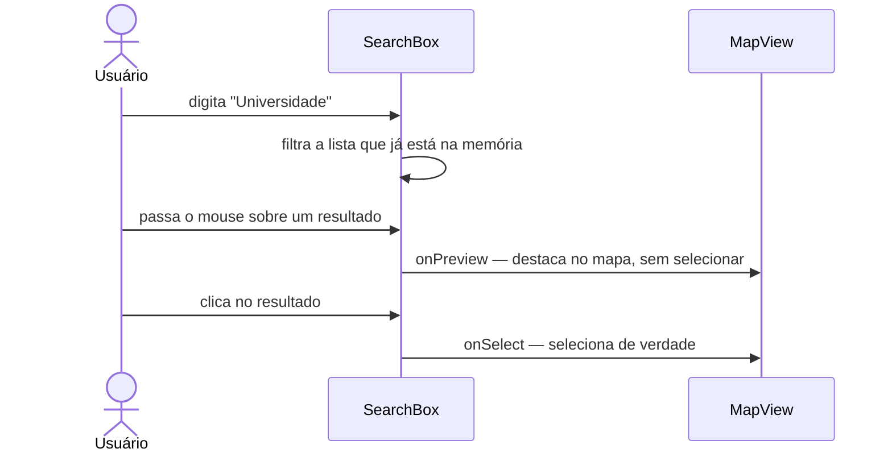

A busca não faz nenhuma chamada de rede: ela filtra a lista que `useGeoIndex` já
carregou (seção 6). Por isso é instantânea.

A diferença entre **prévia** e **seleção** é o que faz a busca parecer responsiva:
passar o mouse já mostra onde fica aquele lugar, sem abrir ficha nem mover o mapa;
só o clique confirma. Diferente do clique no mapa, a busca **pode ir direto a um
loteamento** sem passar pelo bairro — quem digitou o nome já disse o que queria.

---

## 8. Como tema e paleta pintam o mapa

Este é o caminho menos óbvio do projeto, e o que mais confunde quem chega. O truque
é que **as cores moram no CSS**, não no código do mapa.

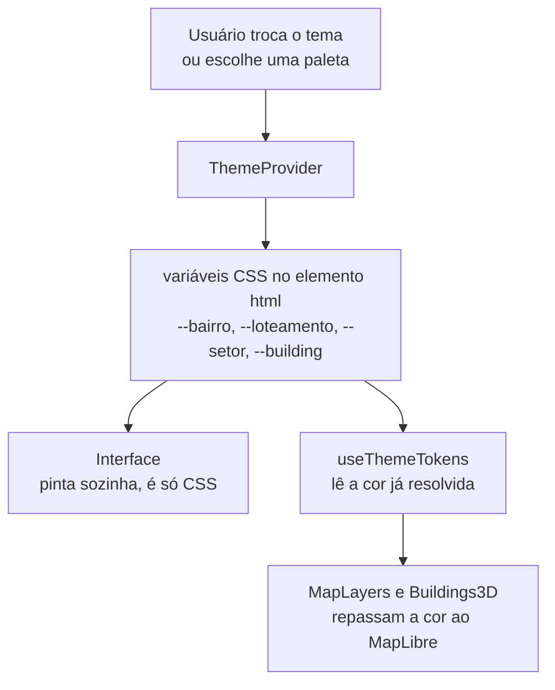

Quando o usuário troca de tema, o `ThemeProvider` marca o tema no elemento `html`, e
o `globals.css` já tem, para cada tema, o valor de cada cor. A interface inteira
muda sozinha a partir daí, porque é só CSS.

O mapa é o caso especial: o MapLibre **não entende variáveis CSS**, ele precisa
receber a cor final (`#a04540`). É exatamente isso que o `useThemeTokens` faz — lê a
cor que o navegador calculou e entrega o valor pronto para `MapLayers` repassar ao
mapa. É o que permite que o seletor de paleta mude a interface e o mapa juntos, sem
duas listas de cores em lugares diferentes.

---

## 9. Os prédios 3D

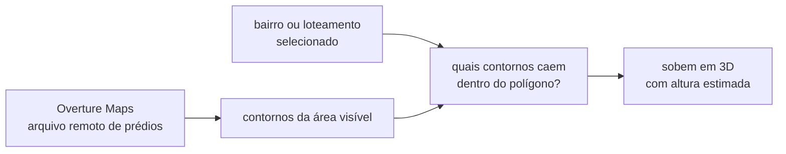

Os prédios não ficam guardados no projeto: o arquivo de origem tem centenas de
gigabytes e mora num servidor público. O mapa baixa só o pedaço correspondente à
área visível, e apenas a partir de um certo nível de zoom — de longe, seriam dezenas
de milhares de formas ilegíveis.

Os prédios também não aparecem todos: só os que estão **dentro do bairro ou
loteamento selecionado** *e* dentro da área que está sendo exibida na tela naquele
momento (se o bairro for grande e você navegar pra ver só um canto dele, o resto não
é processado — chama-se *frustum culling*). Prédios muito pequenos também só
aparecem quando o zoom está bem próximo — de longe, eles seriam pontinhos ilegíveis
(*level of detail*, ou LOD). Essa filtragem é feita em JavaScript, prédio a prédio, e
a altura, como dito na seção 6, é estimada a partir da área.

---

## 10. Onde mexer para...

| Quero... | Mexo em |
|---|---|
| Mudar a cor de um nível num tema | `src/app/globals.css` (o bloco do tema) |
| Mudar as paletas do seletor de cores | `src/lib/color/palette.ts` |
| Mudar espessura de traço ou nome de um nível | `src/config/levels.ts` |
| Mudar quais camadas começam ligadas | `src/config/levels.ts` (`DEFAULT_LAYER_TOGGLES`) |
| Ajustar altura, zoom mínimo ou fonte dos prédios | `src/config/buildings.ts` |
| Mudar o que a ficha mostra | `src/components/panel/FeatureDetails.tsx` |
| Mudar o comportamento de clique/hover no mapa | `src/components/map/MapLayers.tsx` |
| Mudar como os dados são preparados | `scripts/prepare-data.mjs` (e rodar `npm run prepare-data`) |
| Adicionar um novo controle flutuante | `src/components/MapView.tsx` (é ele que posiciona todos) |

> ⚠️ **Nunca edite `src/components/ui/map.tsx`.** É código padrão da lib map-cn e MapLibre, baixado de um registro externo, e é sobrescrito quando reinstalado. 
> Toda customização do mapa é feita passando propriedades a partir do `MapView`.

---

## 11. Para saber mais

| Documento | Para quê |
|---|---|
| [`DECISOES-TECNICAS.md`](./DECISOES-TECNICAS.md) | O "porquê" das decisões: por que tal alternativa foi rejeitada, teoria de cor dos temas, armadilhas de manutenção |
